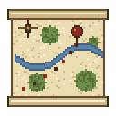
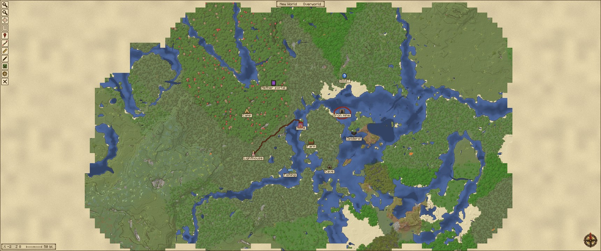
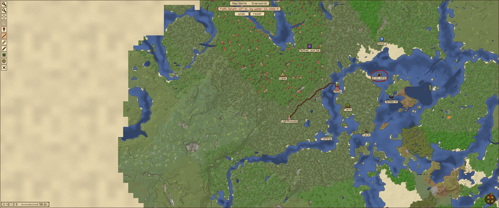
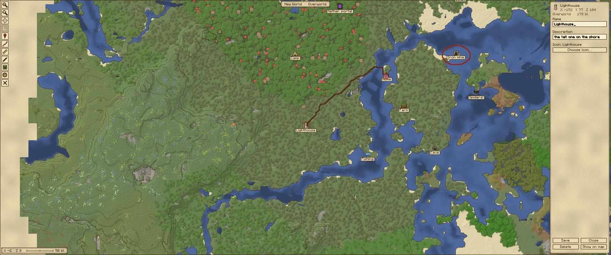
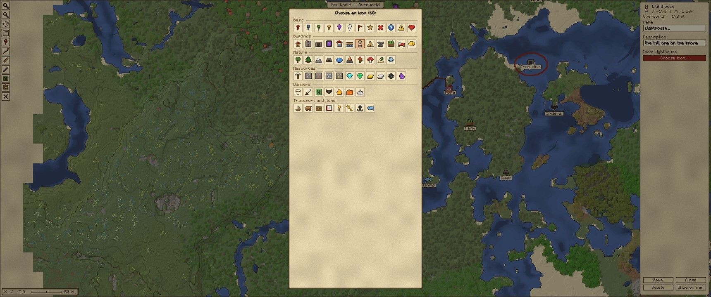
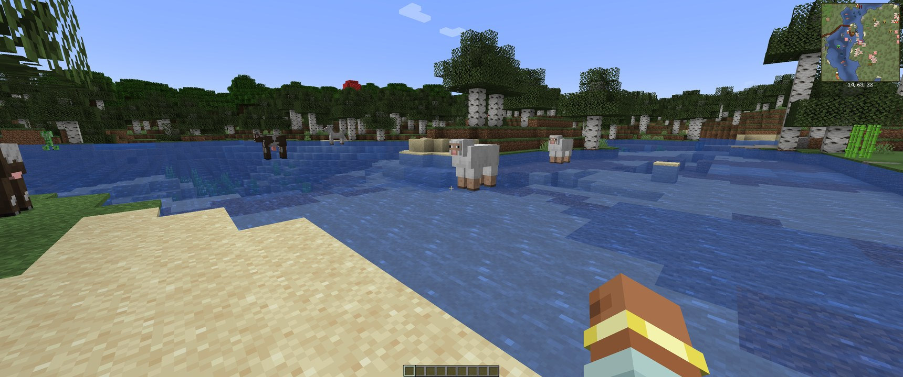

<p align="center"></p>

# Pergament

**A parchment world map and minimap that only shows what you have explored yourself — in real block colors.**

Minecraft 1.20.1 · Forge 47+ · MIT · English / Русский — **[Download](../../releases/latest)**



| | |
|---|---|
|  |  |
|  |  |

*Русское описание — ниже.*

## Installation

1. Install Forge 47 or newer for Minecraft 1.20.1.
2. Put `pergament-<version>.jar` from [Releases](../../releases/latest) into `mods`.
3. In game: `J` — map, `Y` — minimap. Settings — the gear on the map toolbar.

For team features, also put the same jar into the server's `mods` (FTB Teams required there).

## Features

- **Full-screen map** (`J`) and **minimap** (`Y`) in a parchment style: relief shading, contour lines,
  water darker with depth. Block colors come from the actual block textures and biome tint,
  so resource packs and modded blocks look right.
- **Only what you explored.** The map reveals around you as you move: 8 chunks ahead along your view,
  4 behind (configurable). No x-ray, no ores you have not found.
- **Markers** with 60 icons in 6 groups, names and descriptions; a searchable list.
- **Paths**: an A* route from A through any waypoints to B, over explored terrain only
  (water and steep climbs cost more).
- **Ruler**, **pen** with colors and an eraser, **death markers** with the cause of death.
- **Players and mobs**: real player heads; optional mob heads drawn from their actual models
  (vanilla and modded), filtered by height so cave mobs don't clutter the surface.
- **Dimensions**: Nether as a cross-section at your level, End void, any modded dimension;
  a globe button to browse other dimensions you have mapped.
- **Import from Xaero's World Map**: bring the area you already explored with Xaero.
  It is parsed independently, recolored from real textures, and only fills empty areas.
- **GregTech CEu (optional)**: confirmed ore veins (surface indicator with the vein really below it,
  ore mined by hand, prospector results) and a miner grid planner.
  TerraFirmaGreg prospector picks are supported automatically.
- **FTB Teams (optional, needs the mod on the server too)**:
  - see party members on the map (only over explored terrain),
  - share the explored map with party members who also have Pergament —
    your existing map once, then fresh scans live; offline members catch up on join,
  - share confirmed ore finds.

  Markers, drawings, routes and mobs are never shared.

## Compatibility

- Minecraft 1.20.1, Forge 47+.
- Client-side map. The server part is optional: without it (or without FTB Teams) the mod works fully on its own.
  Clients without Pergament can join a server that has it, and vice versa.
- English and Russian.

Inspired by *MapMinecraft* by erkinpaw; all code and art are original.

---

# Пергамент

**Бумажная карта мира и миникарта — только того, что разведал сам, настоящими цветами блоков.**

**[Скачать](../../releases/latest)** · установка: Forge 47+ для 1.20.1, jar — в папку `mods`; `J` — карта, `Y` — миникарта.
Для командных функций тот же jar кладётся и на сервер (там нужен FTB Teams).

## Возможности

- **Карта на весь экран** (`J`) и **миникарта** (`Y`) в стиле пергамента: отмывка рельефа, горизонтали,
  вода темнее на глубине. Цвета — из настоящих текстур блоков и тинта биома: ресурспаки и блоки модов выглядят как в игре.
- **Только разведанное.** Карта открывается вокруг игрока: 8 чанков по взгляду, 4 за спиной (настраивается).
  Никакого рентгена и руд, которых ты не находил.
- **Метки**: 60 значков в 6 группах, название, описание, список с поиском.
- **Тропы**: маршрут A* от A через любые точки до B только по разведанному (вода и крутые подъёмы дороже).
- **Линейка**, **перо** с цветами и ластиком, **метки гибели** с причиной смерти.
- **Игроки и мобы**: настоящие головы игроков; по желанию — головы мобов из их собственных моделей
  (ванилла и моды), с фильтром по высоте, чтобы пещерные мобы не лезли на поверхность.
- **Измерения**: Незер — разрез на уровне игрока, пустота Энда, любые измерения модов; глобус — посмотреть другие.
- **Импорт из Xaero's World Map**: перенести уже разведанное с Xaero. Разбирается самостоятельно, перекрашивается
  по настоящим текстурам и ложится только в пустые места.
- **GregTech CEu (необязательно)**: подтверждённые жилы (индикатор на поверхности и жила под ним,
  руда руками, проспектор) и шахтёр — сетка выработок. Проспекторские кирки TerraFirmaGreg поддерживаются сами.
- **FTB Teams (необязательно, мод нужен и на сервере)**:
  - сокомандники на карте (только над разведанным),
  - обмен открытой картой с сокомандниками, у которых тоже Пергамент: при первом входе — вся своя карта,
    дальше — свежее; кто был офлайн, докачает при входе,
  - обмен подтверждёнными рудами.

  Метки, рисунки, тропы и мобы не передаются никогда.

## Совместимость

- Minecraft 1.20.1, Forge 47+.
- Карта клиентская; серверная часть необязательна: без неё (или без FTB Teams) мод полностью работает сам.
  Клиенты без Пергамента заходят на сервер с ним, и наоборот.
- Русский и английский.

По мотивам *MapMinecraft* (erkinpaw); весь код и графика — свои.

---

## Сборка

JDK 17. GregTech и FTB Teams нужны только для компиляции интеграций (ftb-teams-forge-2001.3.2.jar; в dev-рантайм — с ftb-library и architectury по -Pwith_ftb). GregTech — положить в `libs/` (в git не идут):
`gtceu-1.20.1-7.5.3.jar`, `ldlib-forge-1.20.1-1.0.52.jar`, `configuration-forge-1.20.1-3.1.0.jar`,
а из `META-INF/jarjar` GT — `Registrate-MC1.20-1.3.11.jar`, `mixinextras-forge-0.5.3.jar`.

```
gradlew build
```

Если Mojang/GitHub недоступны напрямую — через SOCKS (`ssh -N -D 127.0.0.1:1088 <хост>`):
`GRADLE_OPTS="-DsocksProxyHost=127.0.0.1 -DsocksProxyPort=1088"` и те же `-D…` в командной строке.

## Самотест в живом клиенте (без рук)

```
gradlew runClient -Ppergament_selftest [-Pwith_gt] [-Ppergament_zoom=2] [-Ppergament_dims=nether,end] [-Ppergament_keeps=0.6,0.8,0.95]
```

Создаёт мир, ждёт скана, открывает карту, проверяет метку, тропу, (с GT) жилы через проспектор и шахтёра,
сохранение на диск; кадры — `run/screenshots/pergament_*.png`, итог — строки `SELFTEST` в выводе.

Галерея голов всех мобов: `-Ppergament_gallery=1`. Командный самотест (dev-сервер с FTB Teams и два клиента,
Alice и Bob, party собирается командами FTB): `bash tools/teamtest.sh`.

Иконки и роза ветров: `python tools/gen_gui.py`; значки меток: `python tools/gen_markers.py`; логотип: `python tools/gen_logo.py`.
Как устроен обмен в команде: [`docs/TEAM_SYNC.md`](docs/TEAM_SYNC.md).

Лицензия — MIT (`LICENSE`).
